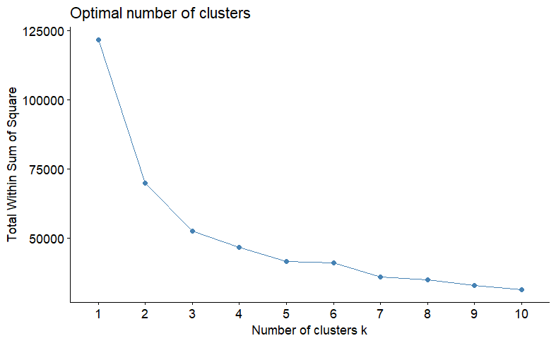
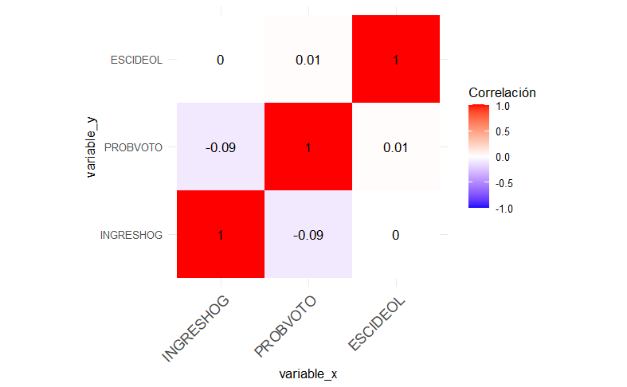

# 🗳️ Analysis of Voting Behavior and Survey Duration

## 📄 Project Overview

This project explores the determinants of voting behavior based on key factors such as household income, voting probability, and ideological self-placement. Additionally, it investigates factors affecting survey duration using statistical modeling techniques.

### 🔍 Objectives

- Analyze voting behavior determinants through data-driven insights.
- Explore factors influencing survey duration.
- Apply statistical modeling techniques to extract key patterns.
- Provide actionable insights for survey design and policy-making.

---

## 📂 Project Structure

```
Voting-Behavior-Analysis/
│-- analysis.Rmd                # R Markdown file with the full analysis
│-- data/
│   ├── voting_behavior.csv      # Dataset on voting behavior
│   ├── survey_duration.csv      # Dataset on survey duration
│-- images/
│   ├── voting_trends.png
│   ├── survey_factors.png
│-- scripts/
│   ├── data_processing.R        # Data cleaning and preparation
│   ├── exploratory_analysis.R   # Exploratory data analysis
│   ├── modeling.R               # Statistical modeling scripts
│-- README.md                    # Project documentation
```

---

## 📊 Data Analysis Summary

### **1. Data Processing**

- **Objective:** Ensure data integrity and readiness for analysis.
- **Key Steps:**
  - Data cleaning and handling missing values.
  - Feature engineering and transformation.

**Visualization:**


---

### **2. Exploratory Data Analysis**

- **Objective:** Identify trends and patterns in voting behavior and survey duration.
- **Key Findings:**
  - Income levels correlate with voting probability.
  - Older respondents take longer to complete surveys.
  
**Visualization:**


---

### **3. Statistical Modeling**

- **Objective:** Determine key factors influencing voting behavior and survey duration.
- **Techniques Used:**
  - Factor analysis to identify underlying relationships.
  - Regression analysis to quantify influences.
  
---

## 🏆 Results Interpretation

- **Voting Behavior:** Household income and ideological placement play a role in voting likelihood.
- **Survey Duration:** Age and ideological self-placement have a minor but notable effect.
- **Implications:** Results inform survey design and targeted outreach strategies.

---

## 🛠️ Installation & Usage

### 1. Clone the repository
```sh
git clone https://github.com/yourusername/voting-behavior-analysis.git
cd voting-behavior-analysis
```

### 2. Install required dependencies
Ensure you have the necessary R packages installed:
```r
install.packages(c("tidyverse", "ggplot2", "car", "MASS"))
```

### 3. Run analysis scripts
```r
source("scripts/data_processing.R")
source("scripts/exploratory_analysis.R")
source("scripts/modeling.R")
```

---

## 🤝 Contributing

Contributions are welcome! Follow these steps:

---

## 📧 Contact

- **Author:** Your Name  
- **Email:** manuelrojasgarcia@gmail.com

---

## 📜 License

Free License.


